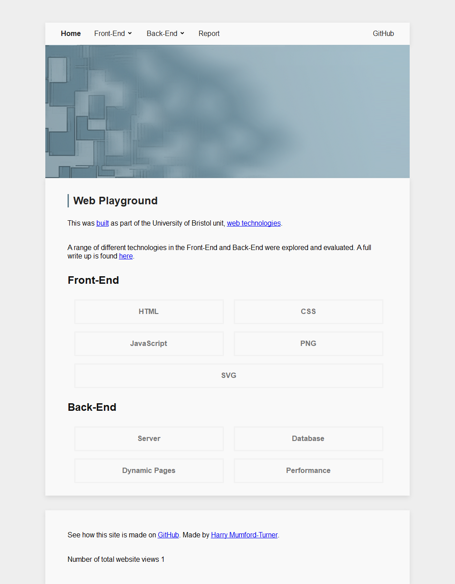

# Web Playground

[](http://gruntjs.com/)

Harry's web playground, demonstrating variety of website development techniques using best practices and standards.

Built for the University of Bristol unit [Web Technologies](https://www.cs.bris.ac.uk/Teaching/Resources/COMSM0104/cw/assign5/).

- TODO: Add show source next to png, svg
- TODO: Link to the stylesheet project, include in release?
- TODO: To stop using some weird node_modules/grunt command, add grunt to npm script, so you do npm run grunt ... https://gruntjs.com/blog/2016-02-11-grunt-1.0.0-rc1-released#npm-scripts
- TODO: Add humans.txt and others, based on https://github.com/h5bp/html5-boilerplate/tree/master/dist
- TODO: Run static analysis tools on CSS, HTML and Javascript https://github.com/mre/awesome-static-analysis#css
- TODO: Rename webtechnologies.herokuapp.com to web_playground.herokuapp.com

- TODO: Add [HTML5 linting](https://github.com/mozilla/html5-lint) & [validation](https://www.npmjs.com/package/html-validator) - Write about it in the [HTML](#html) section


## Setup


Install [dependencies](#dependencies) and read about [grunt](#grunt) first!

- `npm install`
- `grunt server` - view at [http://localhost:3001/](http://localhost:3001/)





#### Dependencies

- Clone project with [Git](https://git-scm.com/downloads). `git clone git@github.com:harrymt/web_playground.git`
- Navigate to that directory `cd web_playground`

- Install [NodeJS](https://nodejs.org/en/)
- Install [Ruby](https://www.ruby-lang.org/en/documentation/installation/).
- Install global SCSS linting with:
	- `gem update --system && gem install scss_lint`
	- OR: `sudo apt-get install scss_lint`
- Not needed? Install [sqlite3](https://www.sqlite.org/download.html) is setup and added to your PATH


#### Grunt

The whole project uses `GruntJS` to handle everything from running to deployment.

- Run `node_modules/grunt-cli/bin/grunt` to run grunt, or
- Install grunt globally, with `sudo npm install -g grunt-cli`

Each one of the following tasks should be run using `grunt <task>`
e.g. `grunt build`.


**[Gruntfile.js](Gruntfile.js)**
```javascript

/**
 * Start Server.
 *
 * Start a Node server - view at localhost:3001.
 *
 * $ grunt server
 */
grunt.registerTask('server', ['exec:server']);

/**
 * Build.
 *
 * Minify and create CSS files
 *
 * $ grunt build
 */
grunt.registerTask('build', ['uglify', 'sass']);

/**
 * Deploy.
 *
 * Deploy to heroku server then run page insight tests
 *
 * $ grunt deploy
 */
grunt.registerTask('deploy', ['lint', 'build', 'exec:deploy', 'pagespeed']);
```

#### (Optional)

- To deploy download [Heroku CLI](https://devcenter.heroku.com/articles/getting-started-with-nodejs#set-up)
- Login to heroku by typing `heroku login`


## Technologies Used

- [Markdown to PDF](https://www.npmjs.com/package/markdown-pdf)
- [sqlite3](https://www.sqlite.org/download.html)
- [SCSS](http://sass-lang.com/)
- [PUG](https://pugjs.org)
